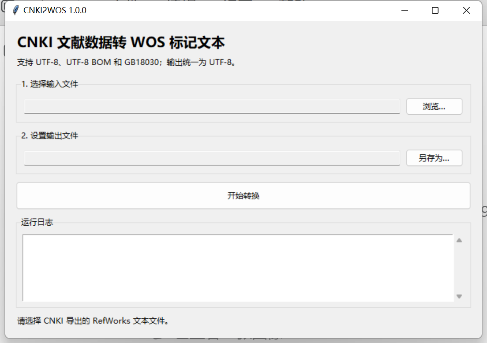

# CNKI2WOS 1.0.0

CNKI2WOS 是一个中文 Windows 图形工具，用于把 CNKI 导出的 RefWorks 标记文本转换为常见文献计量软件可读取的 WOS 两字符标记文本。



## 功能特点

- 支持 UTF-8、UTF-8 BOM 和 GB18030 输入。
- 输出 UTF-8 无 BOM 文本，包含 `FN`、`VR`、`ER` 和 `EF` 文件结构。
- 映射作者、标题、期刊、关键词、摘要、机构、ISSN、DOI、URL、年份、卷期和页码。
- 不虚构发布日期、引用次数、参考文献数或 WOS 分类信息。
- 保留完全重复记录，并为每个输出记录生成唯一 `UT`。
- 转换在后台线程执行，写入失败时不会留下半成品输出。

## 下载和运行

推荐从 [GitHub Releases](https://github.com/Super-dong94/cnki2wos/releases/latest) 下载 `CNKI2WOS_1.0.0_Windows_x64.exe`，并使用同页的 `SHA256SUMS.txt` 校验文件完整性。

程序是未签名的开源可执行文件，Windows SmartScreen 可能显示安全提示。请只从本仓库 Release 下载，并在运行前核对 SHA-256。

## 使用方法

1. 在 CNKI 中选择记录并导出为 RefWorks 文本格式。
2. 运行 CNKI2WOS，点击“浏览…”选择导出的 `.txt` 文件。
3. 确认自动生成的输出路径，或点击“另存为…”修改位置。
4. 点击“开始转换”。日志会显示输入编码、记录数、重复项和跳过项。
5. 将生成的 `_wos.txt` 导入支持 WOS 两字符标记文本的文献计量工具。

## 字段映射

| CNKI RefWorks | WOS 输出 | 说明 |
|---|---|---|
| `RT Journal Article` | `PT J`、`DT Article` | 当前仅支持期刊论文 |
| `A1` | `AU`、`AF` | 作者按分号拆分 |
| `T1` | `TI` | 标题是必需字段 |
| `JF` | `SO` | 来源期刊 |
| `K1` | `DE` | 作者关键词 |
| `AB` | `AB` | 摘要及续行 |
| `AD` | `C1` | 作者地址或机构 |
| `SN`、`DO`、`LK`、`LA` | `SN`、`DI`、`UR`、`LA` | 标识、链接和语言 |
| `YR`、`vo`、`IS`、`OP` | `PY`、`VL`、`IS`、`BP/EP/PG` | 出版信息 |

源数据没有提供的字段会被省略。非数字页码会保留起止文本，但不会猜测页数。

## 从源码运行

需要 Python 3.10 或更高版本，运行时仅使用 Python 标准库：

```powershell
python -m cnki2wos
```

运行测试：

```powershell
python -m unittest discover -s tests -v
python tools\validate_repository.py
```

构建 Windows 发布物：

```powershell
python -m pip install -r requirements-build.txt
.\tools\build_release.ps1
```

## 格式与数据声明

Web of Science 导出文本使用两字符字段标签；Clarivate 的字段表列出了 `FN`、`VR`、`ER`、`EF` 等标签。本工具输出的是面向常见解析器的兼容文本，不是 Clarivate 官方导出数据，也不能赋予记录 WOS 收录状态。

- 官方字段说明：https://webofscience.help.clarivate.com/en-us/Content/export-records.htm
- 真实 CNKI 导出记录可能受数据库条款和文献版权约束，不应直接提交到公开仓库。
- CNKI、Web of Science 和 Clarivate 是其各自权利人的名称或商标；本项目与这些机构无隶属或背书关系。

## 许可证

项目源码和原创文档采用 [MIT License](LICENSE)。Windows 构建所含运行时组件见 [THIRD_PARTY_NOTICES.md](THIRD_PARTY_NOTICES.md)。
